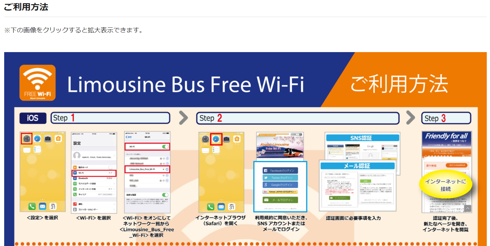

# 2022/03/04

## 1. 家から熊本空港までのルート

- ルート1(採用)  
  - 南熊本→肥後大津→熊本空港  
      電車→肥後ライナー
  - ルート2
    - 食糧事務所→味噌天神→空港  
      都市バス→高速バス

|ルート名|ルート概要|時間|お金(一人)|時刻表|支払い方法|
|:-:|:-|:-:|:-:|:-|:-:|
|ルート1|南熊本→肥後大津 (豊肥本線)|9:26-9:53|¥400|[link](https://goo.gl/maps/4YeDTzNCTZLtJ5h67)|suica|
|ルート1|肥後大津→熊本空港 (肥後ライナー)|10:00-10:15|-|[link](https://kukouliner.com/timetable1.php)|-|
|ルート2|食糧事務所→味噌天神 (都市バス)|8:40-8:53|¥200|[link](https://goo.gl/maps/RT4UaobfLE1CspWeA)|suica|
|ルート2|味噌天神→熊本空港 (空港リムジンバス)|9:15-9:53|¥650|[link](https://www.sankobus.jp/busportal/wp-content/uploads/tt-ap_limousine-20220105.pdf)|suica|

### ルート1の採用理由について

- お金が安い
- 早い

## 2. 熊本空港→羽田空港

- 便名
  - ANA 644
- 時間
  - 熊本(11:00) - 東京(羽田)(12:30)
- 座席
  - 14A(妻)、14B(夫)
- 予約番号
  - 0107
- 到着口
  - 第2ターミナル
- 搭乗手順
  - 2次元バーコードの取得
    - 夫取得済み
    - 嫁追加依頼済み
    - Walletアプリに追加しているため、手荷物検査・保安検査場・搭乗口でかざす
  - 1.ANAのチェックインカウンターへ向かう
  - 2.手荷物検査場にてキャリーを預ける
  - 3.保安検査場にて手荷物検査を行う
  - 4.搭乗
  - 搭乗方法の詳細は[こちら](https://www.ana.co.jp/ja/jp/domestic/prepare/checkin/skip/)
- サービス
  - 機内Wi-Fiインターネット接続サービス有
- 確認番号
  - 759722809
- 料金
  - 支払済

### Wifiサービス接続方法

## 3. 羽田空港→ホテル

バスで移動する。  
飛行機降りてからバスに乗るまでにあまり時間がないため、  
急ぎ目に移動する。  

- 時間
  - 羽田空港　第2ターミナル(13:00) - ホテル(13:38)
- のりば
  - 羽田空港 第２ターミナル
  - 停留所の情報[googleMap](https://www.google.com/maps/place/35%C2%B033'03.0%22N+139%C2%B047'17.4%22E/@35.550821,139.7859833,17z/data=!3m1!4b1!4m5!3m4!1s0x0:0x7f023c45e3e51d40!8m2!3d35.550821!4d139.788172?hl=jp)
  
- 料金
  - 支払済
- 乗車券
  - 乗車の際に下記リンクのQRコードを見せる
  - [リンク](https://webservice.limousinebus.co.jp/web/ReservationQR.aspx?RN=jz9LF%2bmfG1%2fRUwDm4A7%2b%2fQ0XuOPbRGW%2byEMS5C16t5M%3d&lang=jp)
- キャンセル期限
  - 乗車時間5分前
  - [マイページ](https://webservice.limousinebus.co.jp/web/jp/MemberMenu.aspx)→予約一覧→詳細→予約の変更・キャンセルから、  
  予約の変更とキャンセルが行えます。
  - 13:00に間に合いそうになかったら、13:45に変更を行う。
- Wifi付き
  - 利用方法  
  
- 乗車中の注意点
  - シートベルト着用
