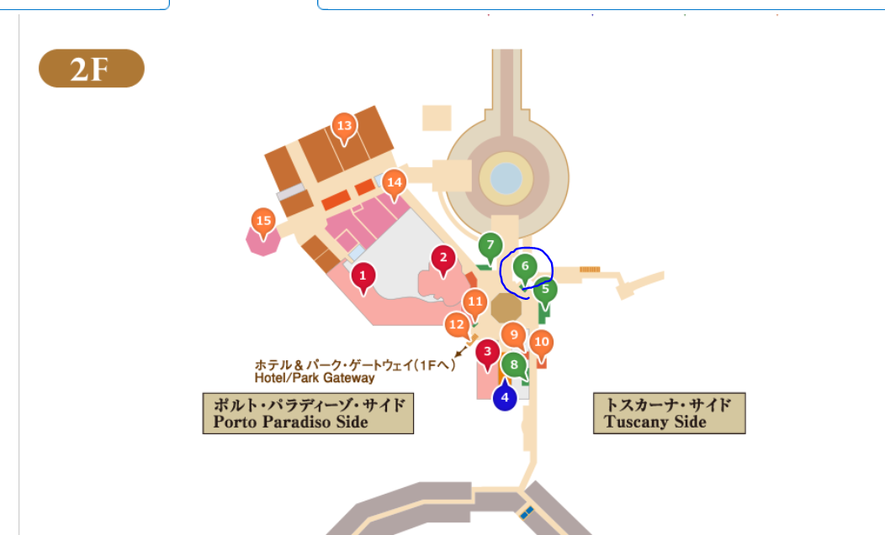

# 2022/03/04

## 1.チェックインについて

- ホテル到着してからチェックインまで時間がある
  - 荷物をベルデスクにて預かってもらい、リゾートラインで散策する？
  
  - リゾートラインのフリーきっぷは- 2F レセプションにて無料で貰える
    
- チェックイン時間
  - 15:00
- オンラインチェックイン
  - 済
  - チェックイン時2F レセプションにて「オンラインチェックイン」利用であることを伝える。
- 15時台はチェックイン希望者が多いみたいで、案内まで時間がかかる予定
- 妻とルームキーを共有する
  - ディズニー公式アプリよりグループ作成」をタップした後、「メンバー招待」をタップ  
    LINEなどで送り参加してもらい、ルームキーをタップし、ルームキー利用者を設定  
    共有OK!
- オンラインチェックイン・ルームキー共有について
  [link](https://www.tokyodisneyresort.jp/hotel/special/onlinecheckin/)
- チェックイン時に客室料金の精算をするっぽい

## 2.チケット購入について(TODO　当日やること)

- 購入するチケット
  - ディズニーシー1デーパスポート
  - 料金
    - 1人&yen;9400
    - 現金またはクレジットで支払い可能
  - 購入場所
    - 2F レセプション
    
  - 購入時間
    - 6：00～22：00
  - 公式サイト
    - [link](https://www.tokyodisneyresort.jp/hotel/topics/info/ticket.html)

## 3.ディナー

- 時間
  - 17:10から
- 場所
  - オチェーアノ
    
- 予約番号
  - 674977062
- 当日のご案内
  - 「予約者名」と「受付番号」を店頭のキャストへお申し出ください。
- アルコール20:00までok
- コース料理のみ
  - 現金orクレジットorお部屋付けでの利用が可能  

## 4.ホテルについて

### 行きたい館内施設

- ミッキランジェロ・ギフト
  - ディズニー関連のお菓子やグッズを買える他、限定グッズも買える  
  - 日用品やスナック菓子、飲料やカップラーメンも揃えてる
  - 営業時間
    - 8:00-22:00
- メダリオンメーカー
  - ホテルオリジナルのスーベニアメダルを作ることができる。1回 100円

[施設の場所などについて](https://www.tokyodisneyresort.jp/hotel/dhm/facility.html#pbBlock2999521)

### 持ち帰り可能なアメニティ

- シャンプー
- コンディショナー
- 入浴剤
- ボディスタオル
- 歯ブラシ
- 子供用歯ブラシ
- ブラシ
- 髭そり
- アメニティーキット
  - 綿棒
  - コットン
  - シャワーキャップ
  - ヘアバンド
- 室内用スリッパ
- ペーパーバッグ
- 卓上のフラワーホルダーの生花
- 無料のコーヒー、お茶
- 子ども用マグカップ
- マドラー
- ポストカード
- 便箋
- ペーパーコースター

電話で、「人数分のアメニティーを用意していただけますか？」ときけば、後ほど部屋へアメニティーを届けてくれるみたい。
