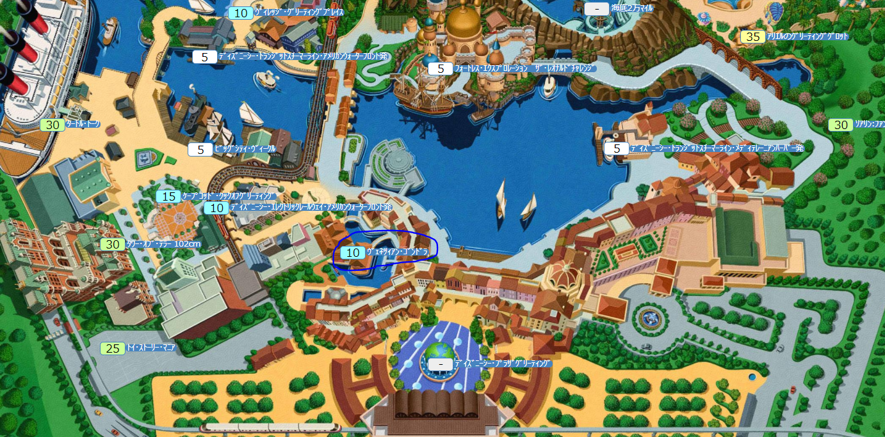

# 2022/03/05

## インパ

アーリーエントリーはないため、直接パークの入り口に並んで入場する。
開園1時間前には並びたい。

- 持ち物
  - 財布
  - スマホ
  - カイロ
  - 折り畳み傘
  - モバイルバッテリー
  - カメラ
  - タオル
  - マスク
  - マフラー
  - 手袋
  - 防寒着

## スタンバイパス対象アトラクション

- タワーオブテラー
- トイストーリーマニア
- タートルトーク
- ソアリン
- マジックランプシアター
- レイジングスピリッツ
- センターオブジアース
- インディージョーンズ

## スタンバイパス対象ショップ

- [アブーズ・バザール](https://www.tokyodisneyresort.jp/tds/shop/detail/650/)
  - ゲーム料金700円

## 乗りたいアトラクション

- トイストーリーマニア
  - トラム(トロッコ)に乗って、ウッディやバズたちと一緒にシューティングゲームを楽しもう！
  - 入園してすぐにスタンバイパス取る
  - 10時頃予定
  - 場所
    - アメリカンウォーターフロント
    
  　

- ソアリン
  - ライドに乗って、世界中の名所や大自然をめぐる雄大な空の旅へ！
  - トイマニの次にスタンバイパス取る
  - 16時頃予定
  - 場所
    - メディテレーニアンハーバー
    
    

- アブーズ・バザール
  - ゲームに挑戦！
  - 参加費700円必須
  - ゲームに成功でぬいぐるみ失敗でバッチ
  - 入園してすぐにスタンバイパス取る(アトラクションとは別枠)
    - パスとるときにアプリでショップにしないと出てこないから注意
  - 13:00頃予定
  - 場所
    - アラビアンコースト
      
      

- ヴェネツィアン・ゴンドラ
  - ゴンドラに乗って魅力的な運河の風景とロマンティックな雰囲気を
  - 19:15頃並ぶ予定
  - 場所
    - メディテレーニアンハーバー
      
      

- アクアトピア
  - とつぜん方向を変えたり、くるくる回ったりするウォータービークル
  - 15:00頃予定
  - 場所
    - ポートディスカバリー
      
      

- 海底２万マイル
- マジックランプシアター
- ニモ&フレンズシーライダー

## 見たいパレード/ショー

- ディズニー・ライト・ザ・ナイト
  - 20:00～
- ミッキー＆フレンズのハーバーグリーティング“タイム・トゥ・シャイン！
  - 13:15/15:10
  - メディテレーニアンハーバー
- ミニー＆フレンズのハーバーグリーティング：トータリー・ミニーマウス
  - 11:30/14:10
  - メディテレーニアンハーバー
- ビッグバンドビート～ア・スペシャルトリート～(エントリー受付)
  - 10:55 / 12:20 / 13:45 / 15:45 / 17:10
  - 10:55で抽選する?
  - アメリカンウォーターフロント

## ドリンク/フード

- [ユカタン・ベースキャンプ・グリル](https://www.tokyodisneyresort.jp/tds/restaurant/detail/459/)
  - ロストリバーデルタ
  - [スパークリングカクテル（ラム＆レモンティー）](https://www.tokyodisneyresort.jp/food/1439/)
    - 1杯 ¥780
  - チキンナゲット
    - ¥340
  - ベジタブルとベーコンのクリームスープ
    - ¥320
  - アソーテッドスナック（ビーフジャーキー、ソーセージ、チョリソー、フライドポテト）
    - ¥650
- [ドックサイドダイナー](https://www.tokyodisneyresort.jp/tds/restaurant/detail/441/)
  - アメリカンウォーターフロント
  - [スパークリングカクテル（ウォッカ＆レモン）](https://www.tokyodisneyresort.jp/food/1683/)
    - 1杯 ¥780
  - [チキンとスクランブルエッグのドリア（カレー風味）](https://www.tokyodisneyresort.jp/food/1406/)
    - フレンチフライポテトセット ¥1,310/単品 ¥920
- [リフレスコス](https://www.tokyodisneyresort.jp/tds/restaurant/detail/416/)
  - メディテレーニアンハーバー
  - [ヨーグルトカクテル（ウォッカ＆ストロベリー）](https://www.tokyodisneyresort.jp/food/1698/)
    - 1杯 ¥780
  - [スパークリングドリンク（レモン＆ジンジャー）](https://www.tokyodisneyresort.jp/food/1438/)
    - 1杯 ¥600
  - [スモークターキーレッグ](https://www.tokyodisneyresort.jp/food/127/)
    - 1個 ¥800
- [ノーチラスギャレー](https://www.tokyodisneyresort.jp/tds/restaurant/detail/421/)
  - ミステリアスアイランド
  - [ギョウザドッグ](https://www.tokyodisneyresort.jp/food/101/)
    - 1個 ¥500
- [ベイサイド・テイクアウト](https://www.tokyodisneyresort.jp/tds/restaurant/food/453/)
  - ポートディスカバリー
  - [寿司ロール（シュリンプ＆チキンカツ）](https://www.tokyodisneyresort.jp/food/131/) 
    - 1本 ¥550

## S.S.コロンビア・ダイニングルーム

- 17:00～
- 受付番号
  - 674946728
- 指定した時間に皆さまおそろいでご来店ください。  
  その際、「予約者名」と「受付番号」を店頭のキャストへお申し出ください。
- [ビアカクテル（オレンジリキュール＆ヴェルモット）](https://www.tokyodisneyresort.jp/food/1679/)
  - 1杯 ¥1,200

- [東京ディズニーシー20周年スペシャルセット](https://www.tokyodisneyresort.jp/food/6/)
  - ¥4,200 ～ ¥5,600
- 予約済み
- 支払い
  - 当日
