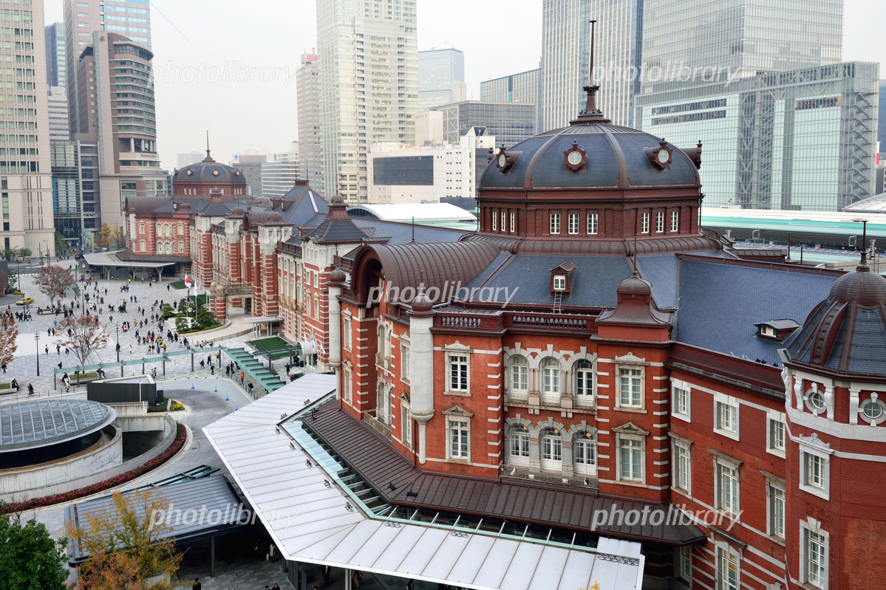
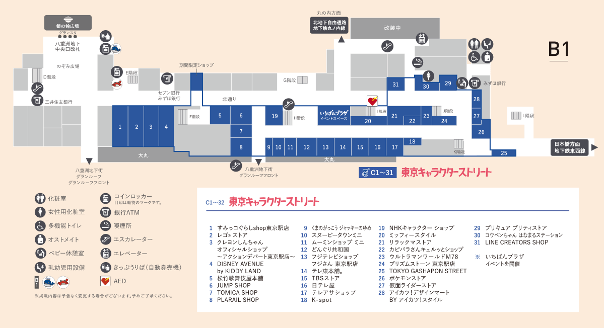
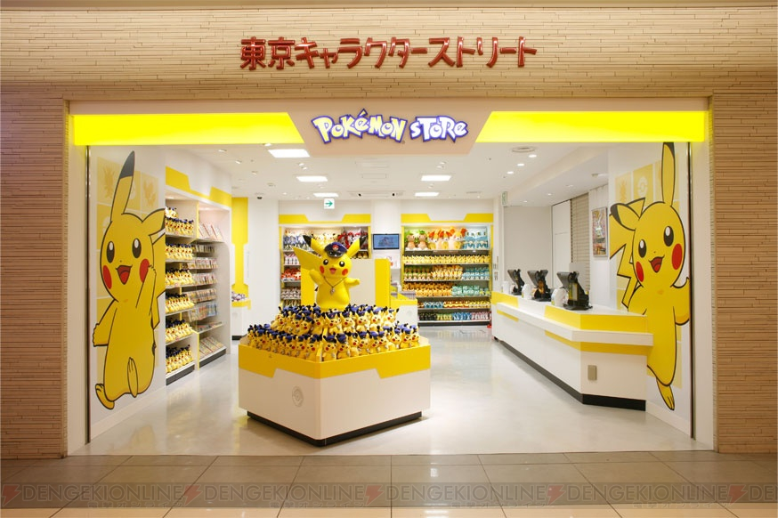
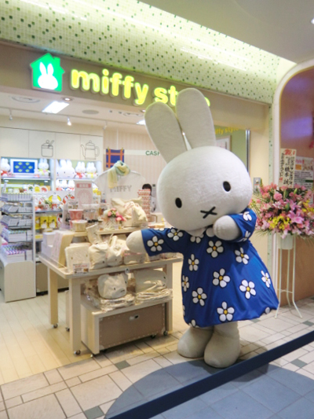
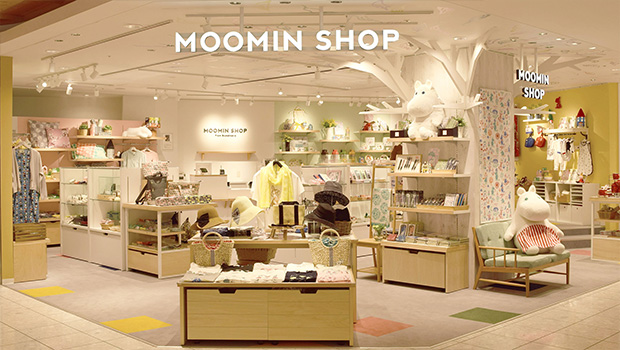
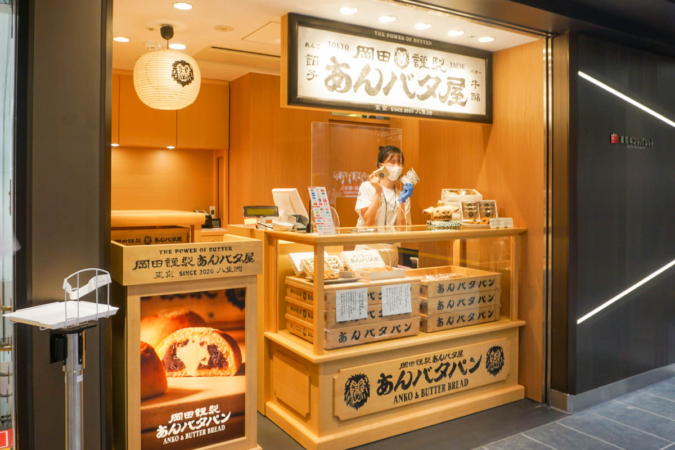
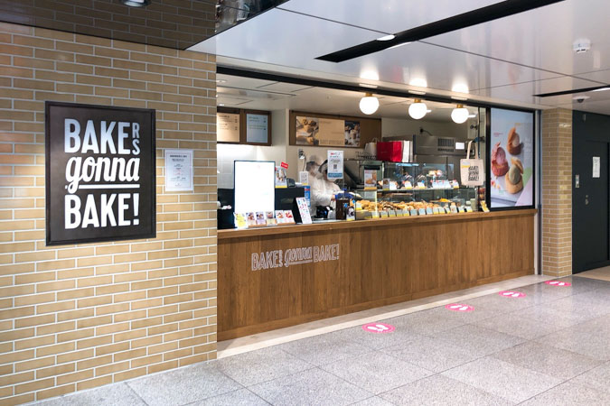
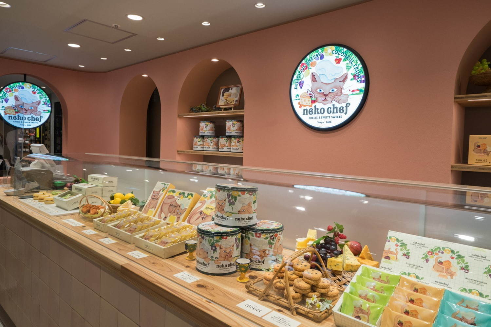

# 2022/03/02

## 東京駅

1～2時間の滞在の予定(13:30～15:30)

## 気になるところ

### 1. 駅舎

2012年に丸の内側は100年前の東京駅を再現した「丸の内駅舎」があり、  
その反対側の八重洲口は近代的な「グランルーフ」があるみたい

### 2. 東京キャラクターストリート

[フロアガイド](https://www.tokyoeki-1bangai.co.jp/shop/?area=area2&floor=b1f&anchor=1)

下記の3つはぜひ行きたい!  
B1F
ほかに気になるところあったらいく!

#### 2.1 ポケモンストア

「ポケモンカジュアルショップ」のコンセプトのもと、「ポケモンセンター」で取り扱う5,000種以上の商品から、  
品揃えを再編集した小型店。  
東京駅ならではの電車をモチーフにしたポケモングッズを取り扱います。

#### 2.2 ミッフィースタイル

『miffy style』は、キデイランドとディック・ブルーナ・ジャパンのコラボレーションによるニュースタイルのオフィシャルショップ。

#### 2.3 ムーミンショップ ミニ

北欧文化やデザインを象徴するアイコン「ムーミン」。  
そのストーリーと原作アートの魅力を取り入れたインテリアや雑貨を揃え、  
居心地の良い「ムーミンなくらし」を提案するオフィシャルブランドショップです。

#### 2.4 東京おかしランド

「ぐりこ・や Kitchen」「森永のおかしなおかし屋さん」「カルビープラス」が集まり、  
「日本初」のお菓子をテーマとしたゾーンとして2012年4月にオープン。
東京キャラクターストリートの横にあるっぽいからいってみたい

### 3. 東京ギフトパレット

[ショップリスト](https://www.tokyoeki-1bangai.co.jp/tokyogiftpalette/)

#### 3.1 岡田勤製あんバタ屋

懐かしいけど新しいあんバタースイーツ”をコンセプトに、  
「あんバタフィナンシェ」と「あんバタパン」を販売しています。

#### 3.2 BAKERS gonna BAKE「スコーン」

店内で焼き上げたスコーンが人気のベイクショップ。  
朝食やおやつにピッタリのスコーンがたくさん売られています！

#### 3.3 ネコシェフ「フィナンシェ＆クッキーアソート」

森にたたずむチーズ工房を住みかにする猫・ネコシェフはお菓子作りが大好き。  
「ネコシェフ」はそんなストーリーを背景にしたチーズと果実のお菓子ブランド。

